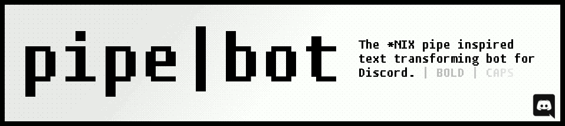

`pipe|bot` is a Discord chatbot that allows you to chain multiple text commands
together with pipes. It also supports arbritrary subgrouping.

## Usage
Basic usage 

## Examples

## Installation
The standard bot can be added to your server with the following link:

I encourage any server owners to modify and self host the bot themselves, as
the bot was built to be easily extensible.

## Commands

<table>

<tr>
<th>Command</th>
<th>Description</th>
</tr>

<tr>
<td>upper</td>
<td>Uppercases</td>
</tr>
</table> 

## Modification and development
This project is licensed under the Simplified BSD license. If modified and
publicly re-released, I ask that you change the name to avoid confusion.

A simple overview of the project files is as follows:

<table style="width:100%">

<tr>
<th>Source file</th>
<th>Function</th>
</tr>

<tr>
<td><code>main.py</code></td>
<td>The Discord bot itself. This is the file run to start the bot.</td>
</tr>

<tr>
<td><code>text_transform.py</code></td>
<td>The hand-written lexer, parser, and generator. The grand majority of the bot's
functionality is implemented here.</td>
</tr>

<tr>
<td><code>commands.py</code></td>
<td>Data related to the bots commands, including aliases, descriptions, examples,
and the names of callbacks.

The end of the file has useful data structures and regex patterns related to
the commands.</td>
</tr>

<tr>
<td><code>command_funcs.py</code></td>
<td>The callback functions for each command.</td>
</tr>

<tr>
<td><code>test.py</code></td>
<td>Hypothesis and Pytest tests, mostly focusing on the lexing / parsing /
generation stages.</td>
<tr>
</table> 

